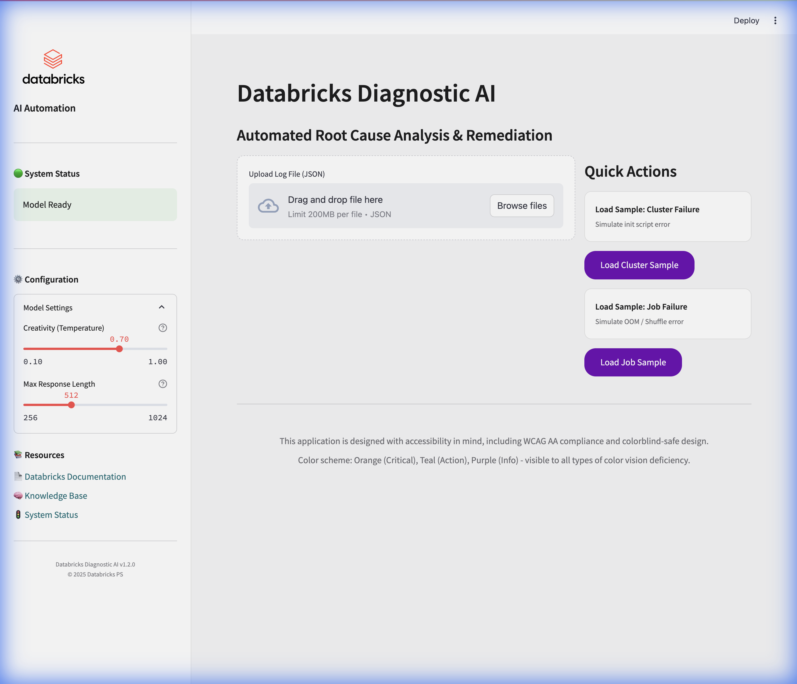
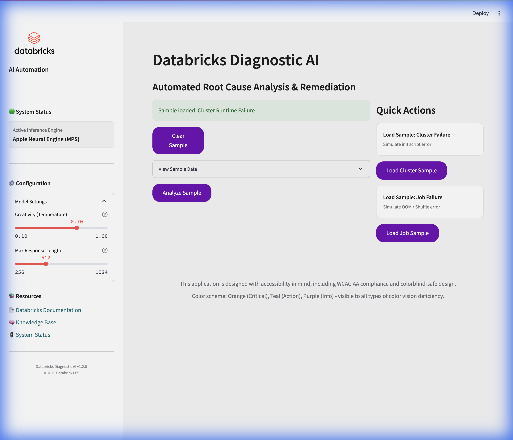
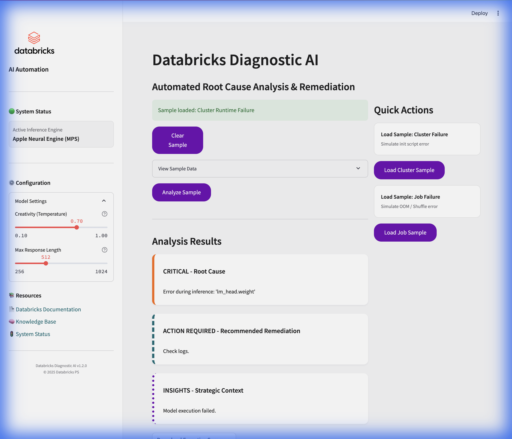

# Databricks PS AI Automation Demo

A realistic demonstration of how Databricks Professional Services can automate log analysis and diagnostics using local AI models.

## Overview

This project simulates a consultant's workflow where they encounter complex cluster or job failures. Instead of manual debugging, they use this AI-powered tool to:
1.  **Ingest** Databricks driver logs or cluster diagnostics.
2.  **Analyze** the logs using a local Hugging Face LLM (e.g., Qwen2.5, Mistral).
3.  **Generate** root cause analysis, remediation steps, and strategic insights.
4.  **Present** findings in a clean, modern dashboard.

## Project Structure

```
Databricks-PS-AI-Automation-Demo/
├── src/
│   ├── app.py               # Streamlit Dashboard
│   ├── log_analyzer.py      # AI Inference Engine (Hugging Face)
│   ├── utils.py             # Helper functions
│   └── sample_data/         # Mock logs for demo
├── notebooks/
│   ├── before_AI_example.py # Manual workflow simulation
│   └── after_AI_example.py  # Automated workflow simulation
├── models/                  # Local model cache (gitignored)
├── requirements.txt         # Python dependencies
└── .env.example             # Configuration template
```

## Setup Instructions

> [!IMPORTANT]
> **Always run this project inside a virtual environment.**
> This ensures dependencies (like `transformers` and `torch`) do not conflict with your system Python.

### Prerequisites
*   Python 3.10+
*   (Optional) GPU for faster inference (CUDA or MPS for Mac)

### 1. Create Virtual Environment

**Mac/Linux:**
```bash
python3 -m venv venv
source venv/bin/activate
```

**Windows:**
```bash
python -m venv venv
.\venv\Scripts\activate
```

### 2. Install Dependencies
```bash
pip install -r requirements.txt
```

### 3. Configuration
Copy the example environment file:
```bash
cp .env.example .env
```
*   Edit `.env` if you want to change the model ID or need a Hugging Face token (for gated models).
*   Default model: `Qwen/Qwen2.5-1.5B-Instruct` (Lightweight, runs well on CPU).

## Running the Demo

### Launch Dashboard
### Launch Dashboard
Make sure your virtual environment is activated:
```bash
source venv/bin/activate  # Mac/Linux
# .\venv\Scripts\activate  # Windows
streamlit run src/app.py
```
The app will open in your browser at `http://localhost:8501`.

### Usage Flow
1.  **Upload**: Click "Browse files" and select one of the JSON files in `src/sample_data/`.
    *   `cluster_runtime_log.json`: Simulates an init script failure.
    *   `job_run_sample.json`: Simulates a Spark Shuffle/OOM error.
2.  **Analyze**: Click the "Analyze Log" button.
3.  **Review**: See the "Root Cause", "Remediation", and "Insights" cards generated by the AI.
4.  **Export**: Download the executive summary.

## Screenshots

### Main Dashboard
The application features a clean, professional interface with an accessible sidebar containing system status, configuration controls, and helpful resources.



### Sample Loading
Users can quickly load pre-configured sample data to test the analysis capabilities. The interface provides clear feedback when samples are loaded.



### Analysis Results
The AI-powered analysis displays results in three color-coded, accessible cards:
- **Critical (Orange):** Root cause identification
- **Action (Teal):** Recommended remediation steps
- **Insights (Purple):** Strategic context and best practices



> **Note:** All colors are designed to be accessible to users with color blindness, and information is conveyed through both color and text labels.

## "Before vs After" Story
Check the `notebooks/` directory to see the code artifacts that tell the story:
*   `before_AI_example.py`: Shows the tedious manual parsing and context switching.
*   `after_AI_example.py`: Shows the streamlined, one-line analysis call.
